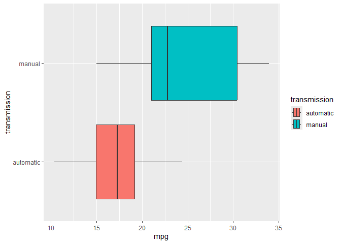
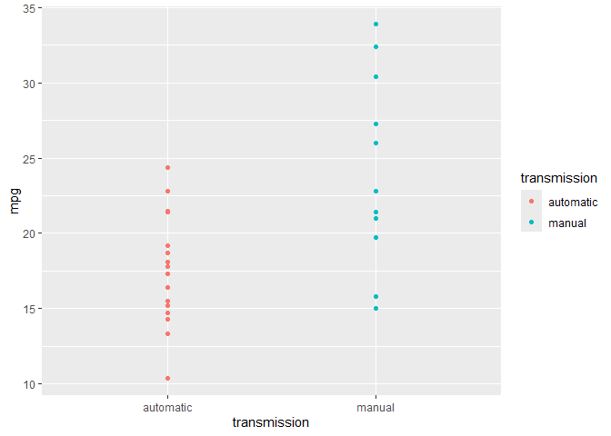
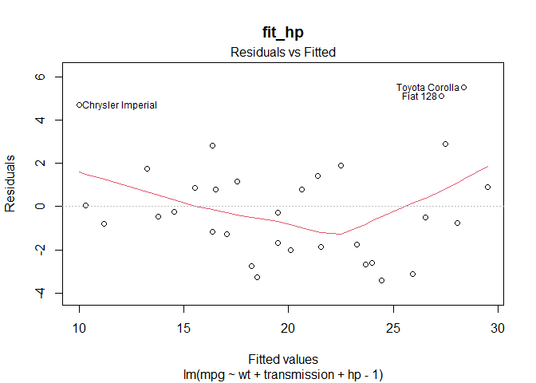
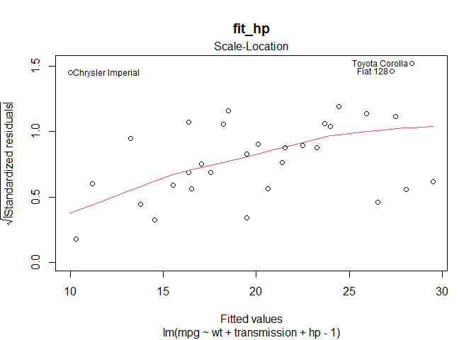
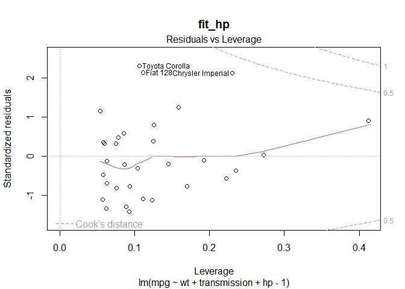

### Package Dependencies

The analysis requires the `dplyr`, `ggplot2`, and `mosaic` packages. See
the **Appendix** for code.

### Data Preprocessing

The `mtcars` data set was transformed for easier analysis. New columns
were created in order to more easily identify the engine and
transmission variables. Also, these new variables `engine` and
`transmission` were coerced to factor variables. See **Appendix** for
code.

### Introduction

This project seeks to analyze and identify any association between fuel
efficiency and transmission. These traits were analyzed directly and by
adjusting for other factors. The data came from the `mtcars` data set
native to R and all analysis was performed within R version 4.4.1.  

### Summary

Nested ANOVA model fit testing **concluded no difference between fuel
efficiency**, `mpg`, based on `transmission`. There were observed
differences in average `mpg` based on `transmission`. However, these
differences did not appear significant when adjusted for other car
traits.

The *95% confidence interval* for the *automatic transmission*
coefficient was *28.6 mpg to 39.4 mpg*, while the interval for the
*manual transmission* coefficient was *32.5 mpg to 39.6 mpg*. Based on
these confidence intervals the **fuel efficiency of automatic
transmission cars could be up to 11 mpg better than or up to 6.9 mpg
worse than the efficiency of manual transmission cars**.Coefficients are
interpreted in more detail in the **Regression Analysis** section.  

A caveat of this analysis is that the chosen model arguably violates
some conditions for linear regression models. In particular in relation
to *residuals.* This is discussed later in the **Regression Analysis**
section.

### Exploratory Data Analysis

Two plots `mpg` vs `transmission` are included below. These plots shows
that manual cars have a higher median `mpg` and a larger spread than
automatics. The plots also indicate that `mpg` increases from automatic
cars to manual cars. See the **Appendix** for additional plots and
statistics. These plots provide a baseline for model selection.

### Model Selection

Initially a regression of `mpg` ~ `transmission` was conducted. This
naive model showed significant differences in the coefficients for
*automatic* (*17.15 mpg*) and *manual* transmission (*24.39 mpg*), but
the residual plots violated the model assumptions. Next a regression was
run with `mpg` against all other variables; however, the full model
found no statistically significant predictors. Due to space constraints
further details for these models have been excluded.  

Since weight (`wt`) has a known causal influence on `mpg`, it was
included in the model. The correlation matrix for each predictor was
consulted in choosing variables for a **nested ANOVA** model fit. I
elected not to use available *automated* stepwise regression after
encountering these
[notes](https://www.stata.com/support/faqs/statistics/stepwise-regression-problems/).
The notes question the diagnostics and inference that result from
automated model selection. **Ultimately, the nested ANOVA procedure
compared 8 models**.

Using nested ANOVA model testing, the following predictors were selected
for the final model: **horsepower, transmission, and weight**. The
nested ANOVA code is located in the **Appendix**. The nested process
also found `qsec` (**quarter mile time**) to be significant. However,
its inclusion caused the *automatic transmission* coefficient to become
insignificant. Therefore `qsec` was excluded from the model. The chosen
model is labeled `fit_hp`.

Note that many models beyond those mentioned were tested. Due to the
large number of significance tests performed, models that cleared
especially low p-values were prioritized to limit Type I errors for the
related **t-tests** and **ANOVA** tests. However, no explicit
calculations were made to identify upper bounds for p-values for
multiple hypothesis testing.  

### Regression Analysis

Below the nested ANOVA model of `mpg ~ wt + transmission + hp`, named
`fit_hp`, is analyzed.

  
The results below give the coefficients, p-values, and 95% confidence
intervals for *automatic* and *manual* transmission from the nested
anova model `fit_hp`.

    ##                       Estimate     Pr(>|t|)
    ## transmissionautomatic 34.00288 2.824030e-13
    ## transmissionmanual    36.08659 1.477711e-18

    ##                          2.5 %   97.5 %
    ## transmissionautomatic 28.58963 39.41612
    ## transmissionmanual    32.52986 39.64331

The coefficients are significant at the 0.1% level, which provides some
protection against Type I error. **Since the models were computed
without an intercept the coefficients indicate the average miles per
gallon of an automatic transmission or manual transmission car within
each model**. For example, an automatic car from the `fit_hp` model
would be expected to have between 28.6 mpg and 39.4 mpg of fuel
efficiency. These numbers represent the average number of additional
miles driven for one additional gallon of fuel.

The plot of residuals vs the fitted values arguably shows a pattern, but
looks *reasonably* scattered. The residuals appear larger for extreme
fitted values suggesting heteroscedasticity, but there is little data in
these regions. The QQ plot is reasonably linear, though the residuals
show potential influential points. This could be explored further using
the influence.measures() function, but due to space constraints it is is
not explored. See the **Appendix** for the residual plots of the
`fit_hp` model and code for influence.measures().

### Appendix

Additional figures and code are included below.

#### Data Preprocessing Code

    # code for data preprocessing
    mtcars$engine <- NULL # create more informative  names for these vars
    mtcars[mtcars$vs == 0,'engine'] <- 'V' # engine label
    mtcars[mtcars$vs == 1,'engine'] <- 'straight' # engine label
    mtcars$transmission <- NULL # create more informative  names for these vars
    mtcars[mtcars$am == 0,'transmission'] <- 'automatic' # transmission label
    mtcars[mtcars$am == 1,'transmission'] <- 'manual' # transmission label
    mtcars$engine <- as.factor(mtcars$engine) 
    mtcars$transmission <- as.factor(mtcars$transmission)

#### Package Dependencies Code

    # install packages required for data processing and analysis

    install.packages('dplyr', repos="http://cran.us.r-project.org");  install.packages('ggplot2', repos="http://cran.us.r-project.org");  install.packages('mosaic', repos="http://cran.us.r-project.org")
    library(dplyr); library(ggplot2);  library(mosaic)

#### Nested ANOVA Code

    # linear models for sequential ANOVA TEST
    wt_only <- lm(mpg ~ wt -1, data = mtcars) # weight only model
    transm_wt <- lm(mpg ~ transmission + wt -1, data = mtcars) # transmission included in nesting
    fit_hp <- lm(mpg ~ wt + transmission + hp - 1, data = mtcars) # horsepower included in nesting
    fit_qsec <- lm(mpg ~ wt + transmission + hp + qsec - 1, data = mtcars) # 1/4 time included in nesting
    fit_vs <- lm(mpg ~ wt + transmission + hp + qsec + vs - 1, data = mtcars) # engine included in nesting
    fit_carb <- lm(mpg ~ wt + transmission + hp + qsec + vs + carb - 1, data = mtcars) # carburetor included in nested fit
    fit_drat <- lm(mpg ~ wt + transmission + hp + qsec + vs + carb + drat - 1, data = mtcars) # axel ratio included in nesting
    fit_gear <- lm(mpg ~ wt + transmission + hp + qsec + vs + carb + drat + gear - 1, data = mtcars) #gears included in nesting

    # nested ANOVA 
    anova(wt_only, transm_wt, fit_hp,fit_qsec,fit_vs,fit_carb,fit_drat, fit_gear) # step wise ANOVA

    ## Analysis of Variance Table
    ## 
    ## Model 1: mpg ~ wt - 1
    ## Model 2: mpg ~ transmission + wt - 1
    ## Model 3: mpg ~ wt + transmission + hp - 1
    ## Model 4: mpg ~ wt + transmission + hp + qsec - 1
    ## Model 5: mpg ~ wt + transmission + hp + qsec + vs - 1
    ## Model 6: mpg ~ wt + transmission + hp + qsec + vs + carb - 1
    ## Model 7: mpg ~ wt + transmission + hp + qsec + vs + carb + drat - 1
    ## Model 8: mpg ~ wt + transmission + hp + qsec + vs + carb + drat + gear - 
    ##     1
    ##   Res.Df    RSS Df Sum of Sq        F    Pr(>F)    
    ## 1     31 3936.6                                    
    ## 2     29  278.3  2    3658.3 277.7379 < 2.2e-16 ***
    ## 3     28  180.3  1      98.0  14.8847 0.0007998 ***
    ## 4     27  160.1  1      20.2   3.0709 0.0930281 .  
    ## 5     26  159.8  1       0.2   0.0377 0.8476721    
    ## 6     25  156.4  1       3.4   0.5204 0.4779544    
    ## 7     24  153.2  1       3.2   0.4833 0.4938789    
    ## 8     23  151.5  1       1.7   0.2630 0.6129269    
    ## ---
    ## Signif. codes:  0 '***' 0.001 '**' 0.01 '*' 0.05 '.' 0.1 ' ' 1

  
Note that a variety of other variables were tested in a nested model
fit, including an interaction term between `wt` and `transmission`.
However, these model resulted in insignificance of *automatic
transmission* or violated model assumptions (residual plot issues).

#### Residual Plots

Reisdual plot of `fit_hp` model discussed in the **Regression Analysis**
section.

    # resized due to page limit
    plot(fit_hp, main = 'fit_hp')

 

#### Additional and Statistics

    # additional plots and statistics (#box plot not printed for space reasons)
    #ggplot(mtcars, aes(x = mpg)) + geom_boxplot() + ggtitle('Fuel Efficency') + 
              xlab('Miles per gallon (mpg)') + theme(plot.title = element_text(hjust = 0.5,)) 

    ## NULL

    # code for summary stats
    mpg_stats <- rbind(favstats(mtcars$mpg), favstats(mtcars[mtcars$transmission == 'automatic','mpg']),
                       favstats(mtcars[mtcars$transmission == 'manual','mpg']))
    row.names(mpg_stats) <- c('total_mpg','automatic_mpg','manual_mpg') # assign row names
    mpg_stats

    ##                min     Q1 median   Q3  max     mean       sd  n missing
    ## total_mpg     10.4 15.425   19.2 22.8 33.9 20.09062 6.026948 32       0
    ## automatic_mpg 10.4 14.950   17.3 19.2 24.4 17.14737 3.833966 19       0
    ## manual_mpg    15.0 21.000   22.8 30.4 33.9 24.39231 6.166504 13       0

    # The influence statistics for the fit_hp model are not printed due to space constraints for the assignment.
    # However, note that dfbetas for transmission coefficients are small in comparison to the confidence intervals
    # influence.measures(fit_hp)

#### Code for Duplicate Figures

  

    # code for plots shown outside appendix

    ## box plot mpg vs transmission 
    ggplot(mtcars, aes(x = mpg, fill = transmission, y = transmission)) + geom_boxplot() 
    ## scatter plot mpg vs transmission
    ggplot(mtcars, aes(x = transmission, y = mpg, color = transmission)) + geom_point() 
